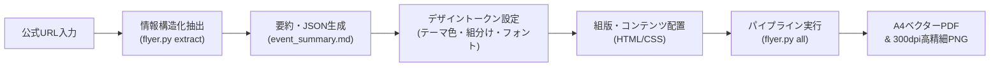

# Event & Tokutenkai Information Flyer Skill

このスキルは、アイドル・アーティストのリリースイベント（リリイベ）、ライブ、特典会（撮影会・お話し会・お渡し会）などにおいて、タイムテーブル、購入レギュレーション、会場フロアマップ、参加注意事項を正確に整理し、印刷・WEB配信用フライヤー（A4ベクターPDF・高精細PNG）をコードベース（HTML/CSS または Typst）で作成・ビルドするためのワークフローを提供します。

---

## ワークフロー概要



---

## ステップ0: 公式URLからの決定論的情報抽出（必須先行ステップ）

イベント告知ページやニュースリリースから情報を収集する際、**AIが自己判断で場当たり的に拾い集めてはなりません**（解釈揺れや重要なレギュレーションの脱落を防ぐため）。
必ず最初に内製抽出ツール [`scripts/flyer.py extract`](./scripts/flyer.py) を実行し、決定論的に整理された要約Markdownと構造化JSONを生成します。

```bash
# 公式URLから情報を抽出し、整理されたMarkdownとJSONを出力
uv run python scripts/flyer.py extract "https://starplanet-academy.com/schedule/item-359/" \
  -o event_summary.md \
  --json event_data.json
```

抽出される構造化データ（`event_summary.md` / `event_data.json`）:
1. **公演概要**: 正式イベント名、開催日程、会場名、フロア、所在地、来場導線（エレベーター/階段）
2. **出演者・組分け**: グループ名、チーム分け（松ぼっくり組・どんぐり組等）、メンバー一覧
3. **タイムテーブル**: 時系列順の正確な時刻・内容・所要時間
4. **対象商品＆購入レギュレーション**: 商品名、品番、価格、1会計購入上限、ループ可否、決済方法
5. **入場＆優先観覧エリア案内**: 集合時刻・場所、入場券配布方法、一般フリー観覧の有無
6. **特典会メニュー・実施順・くじ内訳**: 進行順、メニュー名、必要枚数、くじ賞品内訳（当選個数・指名ルール）、禁止事項
7. **撮可（撮影可能）TIME**: 有無、許可機材（スマホ/一眼）、禁止事項（三脚・一脚・フラッシュ）
8. **注意事項・安全管理・お問い合わせ**: 傘禁止/雨具、手荷物自己管理、禁止行為、お問い合わせ先

---

## ステップ1: 要件確認とアプローチ選択

1. **仕上がりサイズと用途の確認**:
   - 用紙サイズ: A4（210×297mm）、B5（182×257mm）、名刺（91×55mm）など
   - 向き: 縦（portrait） / 横（landscape）
   - 印刷種別: 商業印刷（トンボ・断ち落とし3mm要） / オフィス・家庭用プリンター / デジタル配布PDF

2. **ツールの選択**:
   - **HTML/CSS (Vivliostyle / WeasyPrint)**:
     - Webデザインのノウハウ（Flexbox, CSS Grid, Webフォント）を活かしたい場合
     - デザインの自由度が高く、テンプレート連携（Jinja2 / Mustache等）が容易
     - 推奨実行: `uv run python scripts/flyer.py all index.html`
   - **Typst**:
     - ページ物のカタログ、厳密な表組み、書籍風レイアウトを作成したい場合
     - プレーンテキストで簡潔に記述したい場合
     - 推奨実行: `uv run python scripts/flyer.py all flyer.typ`

---

## ステップ2: テンプレートの配置とカスタマイズ

本スキル内に用意されているテンプレートをプロジェクトにコピーして利用します。

### パターンA: HTML/CSS (Paged Media)

テンプレートディレクトリ:
[templates/html-paged/](./templates/html-paged/)

1. **`theme.css`（デザイントークン）の編集**:
   - ブランドカラー、アクセントカラー、背景色、余白、フォントファミリーを一元管理。
   ```css
   :root {
     --color-primary: #1a73e8;
     --color-secondary: #ff6d00;
     --color-text: #202124;
     --color-bg-sub: #f8f9fa;
     
     --page-margin: 15mm;
     --base-radius: 4px;
     
     --font-base: "Noto Sans JP", -apple-system, sans-serif;
     --font-heading: "Noto Serif JP", serif;
   }
   ```
2. **`layout.css`（印刷ページ設定）**:
   - `@page` ルールで用紙サイズ、マージン、トンボ、断ち落とし（bleed）を設定。
   ```css
   @page {
     size: A4 portrait;
     margin: var(--page-margin);
     bleed: 3mm;
     marks: crop cross;
   }
   ```
3. **`index.html`（コンテンツ編集）**:
   - テキスト、`<table>` による表組み、`<svg>` によるベクターイラストを配置。

### パターンB: Typst

テンプレートファイル:
[templates/typst/flyer.typ](./templates/typst/flyer.typ)

1. 変数定義（色、マージン）を変更:
   ```typst
   #let primary-color = rgb("#1a73e8")
   #let page-margin = 15mm
   ```
2. ページ設定とテキスト・表組みを編集。

---

## ステップ3: CLIによるPDFビルド・検査・プレビュー（flyer.py / uv）

フライヤーのビルド、1ページ検証、高解像度プレビュー、QRコード生成を高速・確実に行うため、本プラグイン付属のツール [`scripts/flyer.py`](./scripts/flyer.py)（または [`scripts/build.sh`](./scripts/build.sh)）を使用します。

### 1. ビルド・1ページ検証・高精細PNG生成の一括実行（推奨）
ワンコマンドで「PDFビルド ➔ ページ数・A4寸法チェック ➔ 300dpi（約2480×3508px）高精細PNG生成」を一気通貫で実行します。
```bash
# HTMLからPDFとPNGプレビューを一括生成
uv run python scripts/flyer.py all index.html

# 出力先を明示する場合
uv run python scripts/flyer.py all index.html -o output.pdf --preview output.png --dpi 300
```

### 2. 個別コマンドの利用

#### A. PDFビルド (`build`)
```bash
# HTML (Vivliostyle)
uv run python scripts/flyer.py build index.html -o output.pdf

# WeasyPrint を明示
uv run python scripts/flyer.py build index.html -o output.pdf --engine weasyprint

# Typst
uv run python scripts/flyer.py build flyer.typ -o output.pdf
```

#### B. ページ数・寸法の検証 (`pages` / `verify`)
PDFがA4 1枚（チラシ1枚もの）に厳密に収まっているか、超過ページがないかを瞬時に検証します。
```bash
# 1ページ厳守チェック（1ページ以外ならエラー終了）
uv run python scripts/flyer.py pages output.pdf --expect 1
```

#### C. 高解像度 PNG プレビューの生成 (`render` / `preview`)
macOS の `qlmanage` や Swift スクリプトに依存せず、PyMuPDF によりクロスプラットフォームで 300dpi（4K解像度相当）のPNGを生成します。
```bash
# 300dpi で第1ページをレンダリング
uv run python scripts/flyer.py render output.pdf -o output.png --dpi 300
```

#### D. ベクター SVG QR コードの生成 (`qr`)
Webの一次情報URLから、印刷でも縮小・拡大でも劣化しないベクターSVG QRコードを生成します。
```bash
uv run python scripts/flyer.py qr "https://example.com/event" -o qr.svg
```

### 3. シェルスクリプトによる呼び出し (`build.sh`)
```bash
./scripts/build.sh auto index.html output.pdf output.png
./scripts/build.sh typst flyer.typ output.pdf
```

---

## トラブルシューティング & ベストプラクティス

* **主客の明確化（関心事の最大化とメリハリ）**:
  - 来場者にとって最も関心が高い「フリーライブ」や「特典会」の内容を紙面の主役とし、全体の半分以上の面積と大きな文字でレイアウトします。物販や入場ルール、注意事項はコンパクトに整理・凝縮します。
* **用紙端まで行き渡る全面背景（白フチの解消）**:
  - 背景画像を用紙全面に敷き詰める場合、`@page { margin: 0; }` を指定し、最外層（`body` またはルート要素）に `background-size: cover;` を設定します。その上でコンテンツを包むコンテナに `padding: 8mm 10mm;` などの内側余白を設定することで、四辺に不自然な白枠を出さずに全面印刷が可能です。
* **大胆なジャンプ率（文字の大きさの階層化）**:
  - タイトル（22〜26pt）、特典会・ライブの目玉見出し（12〜16pt）、くじの賞名やチーム名（10〜11pt）、説明本文（8〜9pt）、注意事項（6.5〜7pt）といった明確な差をつけ、重要な情報がパッと目に飛び込むようにします。
* **重要情報（表組み等）のスペース保護**:
  - 特典会のくじ一覧やスケジュール表などの重要情報テーブルの横に装飾画像を配置すると表が圧迫されて読みづらくなります。表組みは横幅100%を確保し、装飾マスコット画像は見出し周辺やチーム枠などの自然な空きスペースに配置します。
* **時間経過（時系列順）の厳守と視覚的メリハリ**:
  - タイムラインは当日の行動フローに直結するため、必ず時間経過順（10:30物販 ➔ 12:25入場 ➔ 13:00ライブ ➔ 13:45特典会）を厳守します。関心事の強調は順序の入れ替えではなく、鮮やかなアクセントカラーや広いカード面積の割り当てによって行います。
* **大区画ブロック（特典会等）の余白最適化**:
  - 特典会のように情報量が多いセクションでは、メニュー、チーム分け、マスコットを均等グリッドで整列させ、下部に横幅100%のくじ内訳表を密着配置することで、無駄な余白（隙間）を一切出さず充実したレイアウトを実現します。
* **時刻バッジ（ピルバッジ）のサイズ・フォント統一**:
  - 各タイムテーブル項目の時刻バッジ（横幅、高さ、フォントサイズ、パディング）は紙面全体で一律（例: 横幅26mm固定、時刻11pt、ラベル7pt）に揃えます。文字数の違いによってバッジ幅が変わると整列感が失われるため、CSSで固定幅または `min-width` を指定して視線の縦軸を揃えます。
* **タイムテーブル項目の事実純化と装飾的惹句・ポエムの完全排除**:
  - タイムライン各枠に「屋上特設ステージでの全開パフォーマンス！」「最高の熱気をお届け！」などの**装飾的なキャッチコピーやポエム文を記述してはなりません**。
  - 来場者の目的は当日の行動導線とスケジュールの事実把握であるため、「ミニライブ（約45分）」「観覧無料」といった客観的事実のみを端潔に記載し、無駄な文字で紙面を圧迫させないようにします。
* **自明な事務的定型文（「なくなり次第終了」等）の排除**:
  - 特典券や優先入場券について、「定員に達し次第終了」「なくなり次第終了」「配布終了」といった**参加者にとって当たり前の自明な定型文は一切記載しません**。限られた紙面スペースを無駄な文字で浪費することを防ぎます。
* **特典会テーブルの進行順カラムの極小化（数字のみ）または省略**:
  - 特典会テーブルの「進行順」カラムは、ヘッダーを「#」または「順」とし、セル値は「1」「2」といった**数字のみを中央配置**します（「①最初」「第1部」等の余分な文字は不要）。
  - 進行順が公式に発表されていない、または不明なイベントの場合は、**「進行順」カラム自体を完全に省略**し、その分内容・レギュレーション欄の横幅を最大化します。
* **ピクトグラム・アイコン・絵文字による文字削減と直感化**:
  - 文字を長々と読ませず、直感的に0.1秒でルールが伝わるよう、絵文字やベクターSVGピクトグラム（`assets/icons/`）を活用して文字を置き換えます:
    - 撮影禁止: 📸❌（または `no-camera.svg`）
    - スマホ限定: 📱⭕️（または `smartphone-only.svg`）
    - 傘禁止: ☂️❌（または `no-umbrella.svg`）
    - 接触禁止: 🤝❌（または `no-touch.svg`）
    - 手荷物自己管理・手ぶら: 🎒📦（または `bag-basket.svg`）
    - 決済手段: 💴 現金 ｜ 💳 クレジットカード ｜ 📱 QRコード決済
  - これらにより、冗長な説明文を大幅に削ぎ落とし、すっきりとした余白と高い視認性を実現します。
* **フォントの選定と脱・画一化（コンセプトとWebフォントの連動）**:
  - イベントフライヤーを「とりあえず丸ゴシック」と一律に統一せず、グループのコンセプトや楽曲、イベントの性格に応じてフォントスタックを最適に選定します。
  - **公式Webフォント・世界観のリサーチ**: 対象アーティストの公式サイトのInspectやビジュアル資料を確認し、公式で採用されているフォント（例: `Shippori Mincho`, `Jost`, `Cormorant Garamond` 等）や楽曲イメージ（ロック、天使、透明感等）をデザインに取り入れます。
  - **代表的な組み合わせパターン**:
    - **Pop & Rock (モダン角ゴシック + ジオメトリック欧文)**: `Jost` / `Montserrat` + `M PLUS 1p` / `Noto Sans JP`。エッジと視認性の高さを両立。
    - **Angelic / Classical (優美な明朝体 + クラシカルセリフ欧文)**: `Cormorant Garamond` + `Shippori Mincho`（しっぽり明朝）。天使、透明感、上品さ、気品を表現。
    - **Live House / Festival (極太角ゴシック + コンデンスド欧文)**: `Oswald` / `Bebas Neue` + `Noto Sans JP 900`。タワーレコードやライブハウスのような熱気と圧倒的インパクト。
* **初回作成時における複数イメージ／配色のパターン提示**:
  - 初回提案時は、単一の案に絞らず、世界観の異なる数パターン（例: ロック＆パンク、エンジェリックホワイト、ライブハウス現場感など3パターン程度）を作成して提示します。
  - HTMLとCSS（`theme-*.css`）のトークン分離を徹底することで、コンテンツ構造を保ったまま配色・フォント・装飾の異なるバリエーションを迅速に生成・比較検証できます。
* **要素の周囲に半透明の四角い枠や、細長い背景の透過漏れ（シーム）が出る場合（極めて重要）**:
  - **原因**: Chromium/PuppeteerでPDFをレンダリングする際、CSSの `box-shadow` や `filter: drop-shadow`、`mix-blend-mode`（例: multiply）を使用していると、透過レイヤーの分割処理（タイリングやスタッキングコンテキスト）により、バウンディングボックスの半透明矩形アーティファクトや、要素の背後に下層背景画像がスリット状に細長く透けてしまうバグが発生します（画面上では見えずPDFでのみ現れる）。
  - **対策**: 印刷用PDFでは `box-shadow` や `mix-blend-mode` は完全撤廃し、カード背景にはプレーンなソリッドカラー（`#ffffff` 等）を指定してください。境界線（`border`）やコントラストで立体感や区切りを表現し、白背景イラストは白背景カードの上に直接置くことでブレンドモードなしで綺麗に同化させます。
* **参照元URLと印刷用ベクターQRコードの生成・配置**:
  - 印刷物からWebの一次情報や最新情報へ誘導する際は、`npx -y qrcode "<URL>" -t svg -o qr.svg` 等で**ベクター形式（SVG）**として生成します。ラスタ画像（低解像度PNG）のような拡大時のジャギーやボケを防ぎ、精密な印刷品質を担保できます。
  - スマートフォンでのカメラ読み取りを確実にするため、物理サイズは `15mm × 15mm`（推奨 `15.5〜20mm`）以上を確保し、十分なクワイエットゾーン（白余白）を設けてください。
  - カメラで読み取れない状況や、PC等でPDFを閲覧するユーザーのために、QRコード周辺およびフッターにURLテキスト（リンク）も必ず併記します。
  - **【極めて重要・絶対禁止】SVG QRコードの `` 要素への直接 `padding` / `border` / `border-radius` 指定の禁止（Chromium / Skia PDF レンダラーの縦ストローク縮退・スダレ線化バグ防止）**:
    - Chromium / Puppeteer（Skia PDF）において、SVG形式のQRコードを表示する `` タグ自体に CSS で `padding`、`border`、`border-radius`（さらに `box-sizing: border-box`）を直接適用すると、サブピクセル計算の丸め誤差によって縦ストローク（垂直パス）が縮退・クリップされ、QRコードが横縞の「スダレ線」になってカメラ読み取りが完全に不可能になる現象が発生します。
    - **正しい実装**:
      - `` タグ自体には `width: 15.5mm; height: 15.5mm; display: block;` のみを適用し、`padding: 0; border: none;` とします。
      - 白座布団（背景色）や枠線、パディングを設けたい場合は、必ず親のラッパー要素（例: `<div class="qr-container">` や `<div class="qr-box">`）側にスタイルを付与してください。
* **開催場所・前提情報の配置設計（ヘッダー統合と独立カード廃止）**:
  - 最重要の前提情報である「開催場所・会場アクセス」は、タイムテーブルの時刻列と混同しないよう、**必ずヘッダーカード内に統合（`.header-loc-row`）して配置**します。タイムライン先頭に「10:00〜 会場情報」などの独立カードを置くことは、貴重な縦スペース（約15mm）を圧迫し全体の窮屈さを招くため禁止します。施設名、フロア名、注意書き（待機不可・時間厳守）をヘッダー内にコンパクトに整理して配置し、時系列タイムラインとの主従関係を明確にします。
* **ヘッダー内Flexレイアウトのオーバーフロー防止**:
  - ヘッダーで左右分割配置を行う際、テキストに `white-space: nowrap` を多用すると内在幅が紙幅を超え、右側の要素（日付バッジ等）を用紙外へ押し出す原因となります。左側コンテナには `flex: 1 1 auto; min-width: 0;` を指定し、住所などの冗長な表記を簡潔化（例: 施設名＋フロアのみ）してフォントサイズを最適化し、紙面幅内に確実に収めます。
* **Google Fonts のウェイト最小化（Vivliostyle CLIクラッシュ防止）**:
  - 日本語Webフォント（特に `Shippori Mincho` など）を Vivliostyle 等のヘッドレスChromiumベースのレンダラーで読み込む際、ウェイトを多数（500, 700, 800等）指定すると分割.woff2ファイルの過剰フェッチにより内部タイムアウト（`Page.printToPDF: Printing failed`）が発生します。印刷用HTMLでは、必要なウェイトを最小限（例: `wght@700` のみ）に絞ってインポートします。
* **会場フロアマップの「入場案内枠」統合**:
  - ステージ、優先観覧エリア、女性専用エリア、入場導線等の会場図が提供されている場合は、開催場所よりも **【観覧エリア入場案内（整理番号順入場）】の枠内に配置** します。入場順、女性専用エリア、車椅子スペース、入場導線などの図面情報は、実際の入場集合案内の文脈と直接リンクして初めて現場で活きます。D2 CLIやベクターSVG（`floor_map.svg`）として自作・再構成することで、印刷時にも文字が一切潰れず、鮮明な品質を担保できます。
* **長文行間の確保とレギュレーションのタグ・ピルバッジ化**:
  - 特典会の参加条件やレギュレーション（人数、スマホ限定、1レーン開催、代行撮影可否など）は、単に太字にするだけでなく、**ピルバッジ（カラータグ）化・色分け** を行い、文章の行間（`line-height: 1.4〜1.55`）をゆったり広げます。文章が詰まると現場で瞬時に把握できなくなるため、余白と色分けによるスキャナビリティ（一覧性）を高めます。
* **「撮可（撮影可能）TIME」と「特典会（撮影会）」の厳格な峻別**:
  - **撮可TIME（ライブ・イベント中）**:
    - ライブ本編やイベント中は「原則撮影禁止」であるため、特別に設けられる撮影可能時間を指します。
    - 撮可TIMEであっても、静止画のみ / 動画可の区分や、使用可能機材（スマホ限定、コンデジ可、一眼レフ可、一脚・三脚・フラッシュ禁止等）がイベントごとに厳密に指定される場合があります。公式告知の条件をそのまま正確に記載します。
    - **「指示がない場合での撮影禁止」の勝手な全面禁止断定の禁止**: 「メンバー・スタッフからの指示がない場合での写真撮影、動画撮影、録音行為は固く禁止します」という公式告知は、**指示があればOK（＝撮影可能TIME）**を意味します。短く表現したいからといって「撮可TIMEの実施はありません」「撮影・録音 全面禁止」と勝手に決めつけて要約してはなりません（意味が変わる重大な誤記となります）。短縮する場合も「【撮影・録音：指示時のみ可】メンバー・スタッフの指示がある場合を除き禁止」など、条件付きであることを正確に表現します。
  - **撮影会（特典会）**:
    - ライブ終了後に特典券を消費して参加する個別/グループ撮影などを指します（一般にスマホ限定等）。
  - これらを「撮影できる」という点だけで混同せず、別セクション・別レギュレーションとして明確に区別して表記します。
* **物販・特典会における購入レギュレーション（点数制限・組み合わせ・ループ可否）の明示**:
  - リリースイベントや特典会には、混乱防止・公平性のため独自の購入ルールが設けられます。
    - **1度の会計での購入点数（上限数）**: 1会計◯点まで、または「上限数は当日発表」等の制限。
    - **商品の組み合わせ制限**: 同一品番の複数購入制限や、特定盤種とのセット購入条件等。
    - **ループ（買い増しのための並び直し）の可否**: 会計後に再度列の最後尾に並び直して2回目以降の購入を試みる行為の可否（例: 「平日開催のためループ不可で販売開始」「状況により解除」「ループ可能」等）。
  - これらはファンの当日行動（予算・並び方）における最重要情報であるため、商品販売タイムライン枠の直下に目立つアラートバッジ（`alert-rule-tag`）として明記します。
* **一次情報にない事実の推測禁止と禁止事項の過不足排除（事実の厳格性原則）**:
  - サイトに書かれていないことを勝手に推定して明示してはなりません（誤った情報を伝えることになります）。
  - **一般例・現場描写の勝手なルール化・文字化の絶対禁止**:
    - 「長机を挟んで連続して進む」「立ち止まり不可」「荷物は手前のカゴへ預けて完全手ぶら整列」などは、イラスト描写や一般的なアイドルの慣習例に過ぎず、すべてのイベントで公式に定められているとは限りません。
    - **元サイト・一次情報に明記されていない事項を、推測や一般化によってフライヤー本文、表組み、注意書き等のテキストとして記載することは厳禁**とします。
    - 紙面に記載するレギュレーションや禁止事項は、あくまで公式告知ページに明記された客観的事実（例: 接触禁止、着席強要禁止、小道具持たせ禁止、画面録画禁止、Live Photos禁止、BeReal禁止、スマホ限定、ライト落下自己責任等）のみを過不足なく記載します。
  - **必要以上に禁止事項を増やさない**: 公式に書かれていない制約（例: 撮可TIMEで機材制限が明記されていないのに「一眼レフ不可」と決めつける、あるいは逆に「一眼レフ可」と勝手に保証する等）を独断で付加してはなりません。記載がない場合は「詳細は当日会場アナウンスをご確認ください」等に留めます。
  - **指定された禁止事項を省略しない**: 公式に書かれている禁止事項（画面収録・ライブフォト禁止、過度なコール・ジャンプ禁止、ロッカーなし・手荷物自己管理、特典会マスク必須等）を省略・緩和・逆転表記してはなりません。
* **出演者・メンバー名一覧のヘッダー内配置とイメージカラー／組分けチップの反映**:
  - イベント出演者の一覧（姓名フルネーム）は、来場者の関心事として必ずヘッダーカード内にチップ形式（`.member-chip`）で明記します。
  - **メンバーカラーの調査と反映**: 公式サイトのプロフィールページ等を調査し、メンバー固有のイメージカラーが設定されている場合は、チップの背景色・文字色・枠線に各色を忠実に反映します。ファンや参加者にとって直感的な識別性が劇的に向上します。
  - **メンバーカラー設定なし（未設定）グループの扱い**: イメージカラーが存在しないグループ（例: スタプラ研究生/スタアカなど）の場合は、勝手に色を推測・創作してはなりません。その場合はカラーチップではなく、公式のチーム分け・組分け（例: 「🍂 松ぼっくり組」「🌰 どんぐり組」）や学年別などのグループチップ（`.team-chip`）として整然と整理します。
* **特典会の進行順序とテーブルメニュー順の完全一致**:
  - 公式タイムテーブルに示された特典会の実施順（フリーお手振り ➔ ①動画お手振り ➔ ②グループshot ➔ ③2shot/ソロshot）と、メニュー表の行順序を100%揃えます。順番の齟齬をなくすことで、参加者がどのタイミングでどの券を使うべきかが直感的に伝わります。
* **対象商品の品番・盤種バッジ表示**:
  - 複数形態（集合盤、ユニット盤等）のエムカードやCDがある場合、品番（`BTRC-1055`等）と盤種名をセットにしたバッジをタイムライン内に一覧表示し、レジでの注文間違いを未然に防ぎます。
* **4Kディスプレイ・印刷品質でのプレビュー画像生成（flyer.py render）**:
  - 生成されたPDFを目視確認する際、文字潰れを防ぐため `uv run python scripts/flyer.py render <pdf-file> -o <preview.png> --dpi 300` により A4 300dpi相当（2481×3508px）の高精細PNGを出力し、4K環境でも細かな文字・注釈までクッキリ確認できるようにします（macOS `qlmanage` や Swift スクリプト不要）。
* **会場フロアマップの縦長構成と入場案内文の横幅確保**:
  - 会場図が横長の場合、並列する入場案内の横幅を奪って文章が窮屈になり、視線誘導も乱れます。会場図面はステージを上部（または進行方向）に配した**縦長比率（アスペクト比 3:4〜1:1.35程度）**で再構成し、入場案内枠の右側にコンパクトに配置することで、左側の入場案内欄（入場順ステップ、優先／女性専用エリア案内、集合ルール）に十分な横幅を確保し、視認性を最大化します。
* **長文テキストの適正改行と横幅制御**:
  - 紙面縦方向に余裕がある場合、長文を1行に詰め込まず、意味のまとまり（文脈・注意点ごと）に適宜改行（`<br>` やブロック分離）を入れて1行の長さを抑えます。横長すぎるテキストブロックを解消することで、現場での速読性が向上します。
* **カラー絵文字（🚨等）による Chromium / Skia PDF ビルドクラッシュの回避**:
  - Vivliostyle CLI（Puppeteer）内部の Skia / HarfBuzz グリフ処理において、特定のカラー絵文字（例: `🚨` パトランプ等）が含まれていると `ProtocolError (Page.printToPDF): Printing failed` が発生してビルドがクラッシュすることがあります。
  - 印刷用HTMLではクラッシュを誘発しやすいカラー絵文字を避け、安定した標準グリフ記号（`⚠️`、`★`、`📍`、`🎁`、`🎫`、`🎤`、`📸`、`✨`、`📱` 等）やテキストラベル（`【重要】`、`【入場順】` 等）を使用します。
* **出演者名・メンバー名などの固有名詞の完全な正確性**:
  - 出演者やメンバーの氏名は、公式プロフィール等に記載された正式表記（姓名フルネーム、正しい漢字・ひらがな表記）を厳密に用います。略称や名字のみ、推測での表記は行いません。
* **特典会イメージ画像（共通アセット一覧と都度生成のワークフロー）**:
  - 特典会セクションの直感的な理解を促すため、イラスト素材（`assets/illustrations/`）をアイコンや解説図として活用します。
  - **特典会現場描写の厳格ルール（リアリティ原則）**:
    1. **参加者は絶対にマイクを持たない**: マイクを持つのはメンバーやMCのみであり、特典会でファンがマイクを持つことは絶対にありません。
    2. **完全手ぶら原則（荷物・持ち物の持ち込み禁止）**: 特典会では手荷物は事前に荷物置き場（カゴ等）に置くのが通例です。動画撮影（スマホ保持）などの例外を除き、手に物（ペンライト、タオル、バッグ、マイク等）を持つことは一切許可されません。参加者の両手は完全な手ぶら（フリー）として描写します。
    3. **お話し会でのアクリル板の撤廃**: 現在の現場においてアクリル板パーテーションが置かれることは基本的にありません。長机・テーブルを挟んで直接メンバーと対面する形で描写します。
    4. **お見送り会の列参加と長机による接触防止**: お見送り会は参加者が列（キューライン）になって次々と連続して進みます。また、メンバーと参加者の間には長机が物理的な仕切りとして並べられ、直接接触できないように厳格に区切られています。
  - **同梱されている共通イラストアセット**:
    - `reference-characters.jpg`: リファレンス用キャラクターシート（メンバー、ファン、スタッフの正面・背面・表情。ファンは手ぶら）
    - `reference-props.jpg`: リファレンス用備品セット（長机、パイプ椅子、荷物置きカゴ、スマホ、カメラ、色紙、ストップウォッチ、アクリル板撤廃）
    - `reference-goods.jpg`: リファレンス用特典会アイテム・グッズセット（生写真5枚組＆茶封筒、落書きチェキ、CDジュエルケース＆盤面、Mカード、告知ポスター、発光ペンライト、Tシャツ、マフラータオル、特典券）
    - `tokuten-sendoff.jpg`: 全員お見送り会（お手振り会。長机で区切られ、手ぶらのファンが列になって連続して進む）
    - `tokuten-2shot.jpg`: 2ショット撮影会（スタッフがファンのスマホで撮影、手ぶらポーズ、荷物カゴあり）
    - `tokuten-video-sendoff.jpg`: 動画撮影付きお見送り会（長机の仕切り、ファンが列になってスマホ動画撮影しながら進む）
    - `tokuten-talk.jpg`: 個別お話し会（机越し対面・アクリル板なし、ストップウォッチ計測スタッフ）
    - `tokuten-group-shot.jpg`: ユニット集合撮影 / グループショット（メンバー複数名＋手ぶらファン1名、スタッフ撮影）
    - `tokuten-back-oshi-2shot.jpg`: 後ろ向き推し 2shot（メンバーは後ろ向きで衣装・髪型を見せ、手ぶらファンは前向き）
    - `tokuten-autograph.jpg`: サイン会（メンバー着席・机でサイン、ファン直立対面・手ぶら、スタッフ同席、荷物カゴあり）
    - `tokuten-handover.jpg`: CD手渡し会・お渡し会（長机越しに対面、メンバーが両手でCDを手渡し、手ぶらファンが両手で受け取る、スタッフ立ち会い）
  - **特殊な特典会の都度生成ガイド（リファレンス参照必須）**:
    - ハイタッチ会、私物サイン、個別動画撮影など特殊な特典会画像を新たに生成する場合は、既存アセットと世界観・スタイルを揃えるため、`reference-characters.jpg`、`reference-props.jpg`、`reference-goods.jpg` を必ず `ImagePaths` に渡して `generate_image` を実行してください。
    - **プロンプト指定の要点**:
      `Isometric cute flat vector illustration matching the exact art style and character designs in reference images. Clean composition, white background, bright colors, sticker icon clipart style. Completely EMPTY hands for fans (NO microphones, NO penlights, NO bags).`
* **箇条書きの組版原則（`<ul><li>` によるぶら下がりインデントの徹底）**:
  - 箇条書きを `<p>` や `<div>` 内で「・」と `<br>` を使って記述してはなりません。2行目以降の文字が「・」の下に回り込み、文頭の区切りが視覚的に埋もれてしまいます。
  - 必ずセマンティックな `<ul><li>` 構造を用い、CSS でぶら下がりインデント（`padding-left: 1.05em;`、`li::before { content: "・"; position: absolute; left: 0; }`）を適用します。2行目以降のテキストが「・」の右側に垂直に整列することで、速読性と組版の品位が劇的に向上します。
* **AI生成資料における「非公式・AI自動生成」の明記と元サイト確認の義務付け原則**:
  - AIによって生成されたフライヤーや告知資料は、美麗な組版であるほど「公式発表」と誤認される重大なリスクがあり、万一の誤りや急な変更があった場合に現場トラブルを招く恐れがあります。
  - したがって、AIが作成するすべてのイベント案内資料・フライヤーには、以下の**免責表記と元サイト確認の案内を必ず盛り込みます**:
    1. **ヘッダーへのAIバッジ配置禁止とフッターへの集約**: ヘッダーはイベントタイトル、会場、出演者などの来場者最重要情報に集中させるため、「AI生成」などのバッジをヘッダーに配置してはなりません（紙面領域の圧迫を防ぐため）。免責は紙面最下部のフッター免責バー（`.footer-disclaimer`）に一本化します。
    2. **フッターでの明確な免責事項**: フッター枠に「【AI生成・非公式】本資料はAIにより自動生成された非公式の参考まとめです。主催・運営公式の案内ではありません。誤記や変更の可能性があるため、正しい最新情報は必ず公式サイトをご確認ください。」と目立つように明記します。
    3. **公式元サイトへの誘導（ベクターQRコード＋URLテキスト）**: 公式詳細ページへのSVG QRコード（※`` に直接padding/borderを付けないこと）を配置し、その直下に「公式詳細・最新情報 / 必ず元サイトを確認 / 公式URLテキスト」を明記します。
    4. **リポジトリ・ドキュメント（README等）での明記**: 配布物やGitHubリポジトリの `README.md` にも、AI自動生成による非公式参考資料である旨と、元サイトへのリンクを明記します。
* **細かい注意書きの下部集約とタイムラインの行動導線純化**:
  - タイムライン各枠（物販、入場、ライブ、特典会）は「時間・場所・対象商品・誰が・何をするか」という来場者の即時行動導線に集中させます。
  - 決済方法の細かな対象外事項（各種クーポン、ポイントカード、電子マネー、駐車券等）や、施設利用時の注意（階段立ち止まり禁止、徹夜禁止、危険防止ルール等）などの補足的・事務的な細かい注意書きは、タイムライン各カード内に詰め込まず、紙面下部の「注意事項・安全管理・お問い合わせ」枠に一本化して集約します。
* **重複情報の完全排除原則（スペース最適化・シングルソース）**:
  - 紙面スペースは極めて限られているため、同一の案内やルール（例: 傘使用禁止、階段立ち止まり禁止、手荷物管理など）をタイムライン内と注意事項枠の複数箇所で重複して記載してはなりません。
  - 各セクションで扱うべき責務を明確に分離します（入場案内枠は「整理番号順入場」「同伴条件」「フリー観覧の有無」などの入場フローのみに専念し、傘禁止や手荷物管理、安全・施設ルールは下部枠に集約）。
* **特典会テーブルにおける内容量に応じた適正カラム幅配分原則**:
  - テーブルのカラム幅は均等や機械的な配分にしてはなりません。
  - 特に「内容・撮影レギュレーション（くじ内訳、当選条件、指名ルール、撮影機材、注意事項）」は文字数が圧倒的に多いため、テーブル全体の横幅の **58〜65%以上** を最優先で確保します。
  - 「進行順」「特典会メニュー」「必要枚数」は可能な限りコンパクト化し、進行順をメニュー名セル内にバッジ（例: `① 推し運検定`）として同居させるなどして列数を抑え、内容欄のスペースを最大化します。
* **エリア図（フロアマップ）の視認性優先原則（極小マップの禁止・簡略化／省略判断）**:
  - 40mm程度の小スペースに微細な文字や複雑なフロア図を押し込んではなりません（印刷時やスマートフォン表示時に文字が潰れて全く読めなくなるため）。
  - 図を掲載する場合は、主要エリア（ステージ、優先観覧、フリー観覧等）のみを大きな文字とシンプルな幾何学矩形で示した**極限まで簡略化されたピクトグラム的ブロック図**に留めます。
  - 十分な視認性（最低でも文字サイズ6.5pt以上、判読可能な線幅）が確保できない場合は、**無理に図を描画せず潔く省略し、その分入場案内テキストやタイムライン全体の可読性を向上させます**。
* **テーマ連動型背景ビジュアル（AI生成 / SVG / CSS）の必須適用原則**:
  - 単なるフラットな白背景や無地のベタ塗りで済ませてはなりません。
  - イベントのテーマ・世界観（例: 秋の放課後ツアー、スクールアカデミー、ルーフトップ青空等）に合致した背景テクスチャ・ビジュアルを必ず適用します。
  - 画像生成AI（`generate_image` ツール）を用いて、文字を邪魔しない明るく淡い水彩風テクスチャや背景イラストを生成し、`background-size: cover;` で敷き詰めます。
  - 画像生成を行わない場合でも、SVGパターンやCSSグラデーション（やわらかな秋色、ストライプ、ドット等）を用いて紙面全体にテーマ性を持たせます。
* **来場者関心事項の6大急所強調原則（文字削減で生じたスペースの戦略的投資）**:
  - 文字数や自明文を徹底的に削減して生まれたスペースは、余白としてただ放置するのではなく、**来場者が最も知りたい「6大急所情報」を特大化・ラベル化・色分け・アイコン化して直感的に目立たせる**ために投資します:
    1. **開催場所の名前**: 住所は標準サイズで構いませんが、施設名・フロア名（例: 「吉祥寺パルコ 屋上特設ステージ」）はタイトルに次ぐ大文字（9.5pt以上）・太字・カラー枠や座布団でパッと目に飛び込むようにし、アクセス経路（例: `7F ➔ 階段で屋上へ`）をピルバッジ化します。
    2. **特典券の値段・種類・入手レート**: 対象商品名、価格（例: `¥1,000 (税込/セット)`）、入手レート（例: `¥1,000購入ごとに特典券1枚配布`）、対象メニューごとの必要枚数用途タグ（例: `【券1枚】帰りの会` `【券2枚】推し運検定`）、購入上限アラートを目立つピルバッジで横一列に並べます。
    3. **優先観覧券の有無・条件・制約**: 「優先観覧券：あり」を鮮やかなカラーバッジ（緑等）で特大アピールし、「物販にて先着配布（1会計1枚・ランダム）」「12:25 集合・整理番号順」「フリー観覧あり（無料）」の各条件をハイライトピルで並べて0.1秒で把握可能にします。
    4. **ライブのおおよその公演時間**: 「公演時間：約45分間」などの所要時間を目立つイエローなどのカラーピルバッジで配置し、終了予定時刻（例: `13:45終演予定`）をタイムカラム等に併記します。
    5. **特典会の実施順序・必要枚数・内容詳細（特に特殊レギュレーション）**:
       - 実施順序を「先行 ①」「後行 ②」などのバッジで明示。
       - 必要枚数を特大の数字＋価格（例: `2枚 (¥2,000)`、`1枚 (¥1,000)`）の独立カウントバッジで強調。
       - 「推し運検定（ランダムくじ）」のような一般的でない特殊な特典会は、各賞（推し2shot、後ろ向き、3shot、ソロ、グループ等）をカラータグ化し、「メンバー背中向き」「じゃんけん指名」「スマホ持ち自撮り」「列途切れ次第最後に実施」などの特殊ルールを明確に区別・解説します。イラストサムネイルにも枚数・特徴ラベルを付与します。
    6. **特典会の重要ルール**: 「スマホ限定（標準カメラのみ）」「接触・着席強要 禁止」「小道具持たせ 禁止」「画面録画・LivePhoto 禁止」など、公式告知に明記された急所ルールを、SVGアイコン付きの「4大重要ルールカード（グリッド）」としてテーブル直下に整理・視覚化します。

