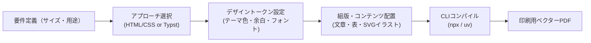

# Event & Tokutenkai Information Flyer Skill

このスキルは、アイドル・アーティストのリリースイベント（リリイベ）、ライブ、特典会（撮影会・お話し会・お渡し会）などにおいて、タイムテーブル、購入レギュレーション、会場フロアマップ、参加注意事項を正確に整理し、印刷・WEB配信用フライヤー（A4ベクターPDF・高精細PNG）をコードベース（HTML/CSS または Typst）で作成・ビルドするためのワークフローを提供します。

---

## ワークフロー概要



---

## ステップ1: 要件確認とアプローチ選択

1. **仕上がりサイズと用途の確認**:
   - 用紙サイズ: A4（210×297mm）、B5（182×257mm）、名刺（91×55mm）など
   - 向き: 縦（portrait） / 横（landscape）
   - 印刷種別: 商業印刷（トンボ・断ち落とし3mm要） / オフィス・家庭用プリンター / デジタル配布PDF

2. **ツールの選択**:
   - **HTML/CSS (Vivliostyle / WeasyPrint)**:
     - Webデザインのノウハウ（Flexbox, CSS Grid, Webフォント）を活かしたい場合
     - デザインの自由度が高く、テンプレート連携（Jinja2 / Mustache等）が容易
     - 推奨実行: `npx vivliostyle build` または `uv run weasyprint`
   - **Typst**:
     - ページ物のカタログ、厳密な表組み、数式、書籍風レイアウトを作成したい場合
     - プレーンテキストで簡潔に記述したい場合
     - 推奨実行: `npx @myriaddreamin/typst-ts-cli compile`

---

## ステップ2: テンプレートの配置とカスタマイズ

本スキル内に用意されているテンプレートをプロジェクトにコピーして利用します。

### パターンA: HTML/CSS (Paged Media)

テンプレートディレクトリ:
[templates/html-paged/](./templates/html-paged/)

1. **`theme.css`（デザイントークン）の編集**:
   - ブランドカラー、アクセントカラー、背景色、余白、フォントファミリーを一元管理。
   ```css
   :root {
     --color-primary: #1a73e8;
     --color-secondary: #ff6d00;
     --color-text: #202124;
     --color-bg-sub: #f8f9fa;
     
     --page-margin: 15mm;
     --base-radius: 4px;
     
     --font-base: "Noto Sans JP", -apple-system, sans-serif;
     --font-heading: "Noto Serif JP", serif;
   }
   ```
2. **`layout.css`（印刷ページ設定）**:
   - `@page` ルールで用紙サイズ、マージン、トンボ、断ち落とし（bleed）を設定。
   ```css
   @page {
     size: A4 portrait;
     margin: var(--page-margin);
     bleed: 3mm;
     marks: crop cross;
   }
   ```
3. **`index.html`（コンテンツ編集）**:
   - テキスト、`<table>` による表組み、`<svg>` によるベクターイラストを配置。

### パターンB: Typst

テンプレートファイル:
[templates/typst/flyer.typ](./templates/typst/flyer.typ)

1. 変数定義（色、マージン）を変更:
   ```typst
   #let primary-color = rgb("#1a73e8")
   #let page-margin = 15mm
   ```
2. ページ設定とテキスト・表組みを編集。

---

## ステップ3: CLIによるPDFビルド

プロジェクトルートまたは対象ディレクトリで以下のコマンドを実行します。

### 1. Vivliostyle（Node.js / npx）
出版・印刷向け組版ツール。トンボや見開き、裁ち落としに対応。
```bash
# ビルド実行（output.pdf を生成）
npx vivliostyle build index.html -o output.pdf

# プレビュー表示（ローカルサーバー起動）
npx vivliostyle preview index.html
```

### 2. WeasyPrint（Python / uv）
PythonベースのCSS Paged Mediaレンダラー。
```bash
# uvでインストール＆即時実行
uv run weasyprint index.html output.pdf
```

### 3. Typst（npx）
Typstソースファイルを即座にPDFへコンパイル。
```bash
npx @myriaddreamin/typst-ts-cli compile flyer.typ output.pdf
```

### 4. 付属のビルドスクリプト
本プラグインの [scripts/build.sh](./scripts/build.sh) を使用して統一的にビルドすることも可能です。
```bash
./scripts/build.sh html index.html output.pdf
# または
./scripts/build.sh typst flyer.typ output.pdf
```

---

## トラブルシューティング & ベストプラクティス

* **主客の明確化（関心事の最大化とメリハリ）**:
  - 来場者にとって最も関心が高い「フリーライブ」や「特典会」の内容を紙面の主役とし、全体の半分以上の面積と大きな文字でレイアウトします。物販や入場ルール、注意事項はコンパクトに整理・凝縮します。
* **用紙端まで行き渡る全面背景（白フチの解消）**:
  - 背景画像を用紙全面に敷き詰める場合、`@page { margin: 0; }` を指定し、最外層（`body` またはルート要素）に `background-size: cover;` を設定します。その上でコンテンツを包むコンテナに `padding: 8mm 10mm;` などの内側余白を設定することで、四辺に不自然な白枠を出さずに全面印刷が可能です。
* **大胆なジャンプ率（文字の大きさの階層化）**:
  - タイトル（22〜26pt）、特典会・ライブの目玉見出し（12〜16pt）、くじの賞名やチーム名（10〜11pt）、説明本文（8〜9pt）、注意事項（6.5〜7pt）といった明確な差をつけ、重要な情報がパッと目に飛び込むようにします。
* **重要情報（表組み等）のスペース保護**:
  - 特典会のくじ一覧やスケジュール表などの重要情報テーブルの横に装飾画像を配置すると表が圧迫されて読みづらくなります。表組みは横幅100%を確保し、装飾マスコット画像は見出し周辺やチーム枠などの自然な空きスペースに配置します。
* **時間経過（時系列順）の厳守と視覚的メリハリ**:
  - タイムラインは当日の行動フローに直結するため、必ず時間経過順（10:30物販 ➔ 12:25入場 ➔ 13:00ライブ ➔ 13:45特典会）を厳守します。関心事の強調は順序の入れ替えではなく、鮮やかなアクセントカラーや広いカード面積の割り当てによって行います。
* **大区画ブロック（特典会等）の余白最適化**:
  - 特典会のように情報量が多いセクションでは、メニュー、チーム分け、マスコットを均等グリッドで整列させ、下部に横幅100%のくじ内訳表を密着配置することで、無駄な余白（隙間）を一切出さず充実したレイアウトを実現します。
* **時刻バッジ（ピルバッジ）のサイズ・フォント統一**:
  - 各タイムテーブル項目の時刻バッジ（横幅、高さ、フォントサイズ、パディング）は紙面全体で一律（例: 横幅26mm固定、時刻11pt、ラベル7pt）に揃えます。文字数の違いによってバッジ幅が変わると整列感が失われるため、CSSで固定幅または `min-width` を指定して視線の縦軸を揃えます。
* **タイムテーブル項目間の隙間（デッドスペース）の解消とイラスト演出**:
  - 項目間の隙間が広くなりすぎると散漫な印象になるため、料金・出演者・見どころ説明などの記述に余裕を持たせ、目玉項目（ミニライブ等）にはステッカー風のワンポイントイラスト（マイク・音符等）や目立つバッジを配置して隙間を埋め、楽しい密度感を演出します。
* **フォントの選定と脱・画一化（コンセプトとWebフォントの連動）**:
  - イベントフライヤーを「とりあえず丸ゴシック」と一律に統一せず、グループのコンセプトや楽曲、イベントの性格に応じてフォントスタックを最適に選定します。
  - **公式Webフォント・世界観のリサーチ**: 対象アーティストの公式サイトのInspectやビジュアル資料を確認し、公式で採用されているフォント（例: `Shippori Mincho`, `Jost`, `Cormorant Garamond` 等）や楽曲イメージ（ロック、天使、透明感等）をデザインに取り入れます。
  - **代表的な組み合わせパターン**:
    - **Pop & Rock (モダン角ゴシック + ジオメトリック欧文)**: `Jost` / `Montserrat` + `M PLUS 1p` / `Noto Sans JP`。エッジと視認性の高さを両立。
    - **Angelic / Classical (優美な明朝体 + クラシカルセリフ欧文)**: `Cormorant Garamond` + `Shippori Mincho`（しっぽり明朝）。天使、透明感、上品さ、気品を表現。
    - **Live House / Festival (極太角ゴシック + コンデンスド欧文)**: `Oswald` / `Bebas Neue` + `Noto Sans JP 900`。タワーレコードやライブハウスのような熱気と圧倒的インパクト。
* **初回作成時における複数イメージ／配色のパターン提示**:
  - 初回提案時は、単一の案に絞らず、世界観の異なる数パターン（例: ロック＆パンク、エンジェリックホワイト、ライブハウス現場感など3パターン程度）を作成して提示します。
  - HTMLとCSS（`theme-*.css`）のトークン分離を徹底することで、コンテンツ構造を保ったまま配色・フォント・装飾の異なるバリエーションを迅速に生成・比較検証できます。
* **要素の周囲に半透明の四角い枠や、細長い背景の透過漏れ（シーム）が出る場合（極めて重要）**:
  - **原因**: Chromium/PuppeteerでPDFをレンダリングする際、CSSの `box-shadow` や `filter: drop-shadow`、`mix-blend-mode`（例: multiply）を使用していると、透過レイヤーの分割処理（タイリングやスタッキングコンテキスト）により、バウンディングボックスの半透明矩形アーティファクトや、要素の背後に下層背景画像がスリット状に細長く透けてしまうバグが発生します（画面上では見えずPDFでのみ現れる）。
  - **対策**: 印刷用PDFでは `box-shadow` や `mix-blend-mode` は完全撤廃し、カード背景にはプレーンなソリッドカラー（`#ffffff` 等）を指定してください。境界線（`border`）やコントラストで立体感や区切りを表現し、白背景イラストは白背景カードの上に直接置くことでブレンドモードなしで綺麗に同化させます。
* **参照元URLと印刷用ベクターQRコードの生成・配置**:
  - 印刷物からWebの一次情報や最新情報へ誘導する際は、`npx -y qrcode "<URL>" -t svg -o qr.svg` 等で**ベクター形式（SVG）**として生成します。ラスタ画像（低解像度PNG）のような拡大時のジャギーやボケを防ぎ、精密な印刷品質を担保できます。
  - スマートフォンでのカメラ読み取りを確実にするため、物理サイズは `15mm × 15mm` 以上を確保し、十分なクワイエットゾーン（白余白）を設けてください。
  - カメラで読み取れない状況や、PC等でPDFを閲覧するユーザーのために、QRコード周辺およびフッターにURLテキスト（リンク）も必ず併記します。
* **開催場所・前提情報の配置設計（ヘッダー統合）**:
  - 最重要の前提情報である「開催場所・会場アクセス」は、タイムテーブルの時刻列と混同しないよう、ヘッダーカード内に統合するか、ヘッダー直下に上方に配置します。施設名、フロア名、注意書き（待機不可・時間厳守）を整理して配置し、タイムラインとの主従関係を明確にします。
* **ヘッダー内Flexレイアウトのオーバーフロー防止**:
  - ヘッダーで左右分割配置を行う際、テキストに `white-space: nowrap` を多用すると内在幅が紙幅を超え、右側の要素（日付バッジ等）を用紙外へ押し出す原因となります。左側コンテナには `flex: 1 1 auto; min-width: 0;` を指定し、住所などの冗長な表記を簡潔化（例: 施設名＋フロアのみ）してフォントサイズを最適化し、紙面幅内に確実に収めます。
* **Google Fonts のウェイト最小化（Vivliostyle CLIクラッシュ防止）**:
  - 日本語Webフォント（特に `Shippori Mincho` など）を Vivliostyle 等のヘッドレスChromiumベースのレンダラーで読み込む際、ウェイトを多数（500, 700, 800等）指定すると分割.woff2ファイルの過剰フェッチにより内部タイムアウト（`Page.printToPDF: Printing failed`）が発生します。印刷用HTMLでは、必要なウェイトを最小限（例: `wght@700` のみ）に絞ってインポートします。
* **会場フロアマップの「入場案内枠」統合**:
  - ステージ、優先観覧エリア、女性専用エリア、入場導線等の会場図が提供されている場合は、開催場所よりも **【観覧エリア入場案内（整理番号順入場）】の枠内に配置** します。入場順、女性専用エリア、車椅子スペース、入場導線などの図面情報は、実際の入場集合案内の文脈と直接リンクして初めて現場で活きます。D2 CLIやベクターSVG（`floor_map.svg`）として自作・再構成することで、印刷時にも文字が一切潰れず、鮮明な品質を担保できます。
* **長文行間の確保とレギュレーションのタグ・ピルバッジ化**:
  - 特典会の参加条件やレギュレーション（人数、スマホ限定、1レーン開催、代行撮影可否など）は、単に太字にするだけでなく、**ピルバッジ（カラータグ）化・色分け** を行い、文章の行間（`line-height: 1.4〜1.55`）をゆったり広げます。文章が詰まると現場で瞬時に把握できなくなるため、余白と色分けによるスキャナビリティ（一覧性）を高めます。
* **「撮可（撮影可能）TIME」と「特典会（撮影会）」の厳格な峻別**:
  - **撮可TIME（ライブ・イベント中）**:
    - ライブ本編やイベント中は「原則撮影禁止」であるため、特別に設けられる撮影可能時間を指します。
    - 撮可TIMEであっても、静止画のみ / 動画可の区分や、使用可能機材（スマホ限定、コンデジ可、一眼レフ可、一脚・三脚・フラッシュ禁止等）がイベントごとに厳密に指定される場合があります。公式告知の条件をそのまま正確に記載します。
  - **撮影会（特典会）**:
    - ライブ終了後に特典券を消費して参加する個別/グループ撮影などを指します（一般にスマホ限定等）。
  - これらを「撮影できる」という点だけで混同せず、別セクション・別レギュレーションとして明確に区別して表記します。
* **物販・特典会における購入レギュレーション（点数制限・組み合わせ・ループ可否）の明示**:
  - リリースイベントや特典会には、混乱防止・公平性のため独自の購入ルールが設けられます。
    - **1度の会計での購入点数（上限数）**: 1会計◯点まで、または「上限数は当日発表」等の制限。
    - **商品の組み合わせ制限**: 同一品番の複数購入制限や、特定盤種とのセット購入条件等。
    - **ループ（買い増しのための並び直し）の可否**: 会計後に再度列の最後尾に並び直して2回目以降の購入を試みる行為の可否（例: 「平日開催のためループ不可で販売開始」「状況により解除」「ループ可能」等）。
  - これらはファンの当日行動（予算・並び方）における最重要情報であるため、商品販売タイムライン枠の直下に目立つアラートバッジ（`alert-rule-tag`）として明記します。
* **一次情報にない事実の推測禁止と禁止事項の過不足排除（事実の厳格性）**:
  - サイトに書かれていないことを勝手に推定して明示してはなりません（誤った情報を伝えることになります）。
  - **必要以上に禁止事項を増やさない**: 公式に書かれていない制約（例: 撮可TIMEで機材制限が明記されていないのに「一眼レフ不可」と決めつける、あるいは逆に「一眼レフ可」と勝手に保証する等）を独断で付加してはなりません。記載がない場合は「詳細は当日会場アナウンスをご確認ください」等に留めます。
  - **指定された禁止事項を省略しない**: 公式に書かれている禁止事項（画面収録・ライブフォト禁止、過度なコール・ジャンプ禁止、ロッカーなし・手荷物自己管理、特典会マスク必須等）を省略・緩和・逆転表記してはなりません。
* **アイドルグループの「メンバーイメージカラー」の調査とデザイン反映**:
  - アイドルグループにはメンバーごとに固有の「イメージカラー（メンバーカラー）」が設定されていることが多いです。
  - 公式サイトのプロフィールページを調査すると、カラー名が明記されているか、または各メンバーの見出し・背景色・スタイルシート（CSS）で色分けされています。
  - イメージカラーが設定されている場合は、出演者一覧、レーン分け、特典会テーブル、担当ユニット盤の紹介等において、各メンバーの名前やバッジをそのイメージカラーで色分けして記述することで、ファンや参加者にとって視認性が格段に向上します。
* **特典会の進行順序とテーブルメニュー順の完全一致**:
  - 公式タイムテーブルに示された特典会の実施順（フリーお手振り ➔ ①動画お手振り ➔ ②グループshot ➔ ③2shot/ソロshot）と、メニュー表の行順序を100%揃えます。順番の齟齬をなくすことで、参加者がどのタイミングでどの券を使うべきかが直感的に伝わります。
* **対象商品の品番・盤種バッジ表示**:
  - 複数形態（集合盤、ユニット盤等）のエムカードやCDがある場合、品番（`BTRC-1055`等）と盤種名をセットにしたバッジをタイムライン内に一覧表示し、レジでの注文間違いを未然に防ぎます。
* **4Kディスプレイ・印刷品質でのプレビュー画像生成**:
  - 生成されたPDFを目視確認する際、文字潰れを防ぐため `qlmanage -t -s 3508 -o <dir> <pdf-file>` や Swift PDFKitレンダリングにより A4 300dpi相当（2480×3508px）以上の高精細PNGを出力し、4K環境でも細かな文字・注釈までクッキリ確認できるようにします。
* **会場フロアマップの縦長構成と入場案内文の横幅確保**:
  - 会場図が横長の場合、並列する入場案内の横幅を奪って文章が窮屈になり、視線誘導も乱れます。会場図面はステージを上部（または進行方向）に配した**縦長比率（アスペクト比 3:4〜1:1.35程度）**で再構成し、入場案内枠の右側にコンパクトに配置することで、左側の入場案内欄（入場順ステップ、優先／女性専用エリア案内、集合ルール）に十分な横幅を確保し、視認性を最大化します。
* **長文テキストの適正改行と横幅制御**:
  - 紙面縦方向に余裕がある場合、長文を1行に詰め込まず、意味のまとまり（文脈・注意点ごと）に適宜改行（`<br>` やブロック分離）を入れて1行の長さを抑えます。横長すぎるテキストブロックを解消することで、現場での速読性が向上します。
* **カラー絵文字（🚨等）による Chromium / Skia PDF ビルドクラッシュの回避**:
  - Vivliostyle CLI（Puppeteer）内部の Skia / HarfBuzz グリフ処理において、特定のカラー絵文字（例: `🚨` パトランプ等）が含まれていると `ProtocolError (Page.printToPDF): Printing failed` が発生してビルドがクラッシュすることがあります。
  - 印刷用HTMLではクラッシュを誘発しやすいカラー絵文字を避け、安定した標準グリフ記号（`⚠️`、`★`、`📍`、`🎁`、`🎫`、`🎤`、`📸`、`✨`、`📱` 等）やテキストラベル（`【重要】`、`【入場順】` 等）を使用します。
* **出演者名・メンバー名などの固有名詞の完全な正確性**:
  - 出演者やメンバーの氏名は、公式プロフィール等に記載された正式表記（姓名フルネーム、正しい漢字・ひらがな表記）を厳密に用います。略称や名字のみ、推測での表記は行いません。
* **特典会イメージ画像（共通アセット一覧と都度生成のワークフロー）**:
  - 特典会セクションの直感的な理解を促すため、イラスト素材（`assets/illustrations/`）をアイコンや解説図として活用します。
  - **同梱されている共通イラストアセット**:
    - `reference-characters.jpg`: リファレンス用キャラクターシート（メンバー、ファン、スタッフの正面・背面・表情）
    - `reference-props.jpg`: リファレンス用備品セット（長机、パイプ椅子、アクリル板、スマホ、カメラ、色紙、チケット）
    - `tokuten-sendoff.jpg`: 全員お見送り会（お手振り会）
    - `tokuten-2shot.jpg`: 2ショット撮影会（スタッフ撮影、ピース・ハート等）
    - `tokuten-video-sendoff.jpg`: 動画撮影付きお見送り会（ファンがスマホ動画撮影しながら進む）
    - `tokuten-talk.jpg`: 個別お話し会（パーテーション・机越し、ストップウォッチ計測スタッフ）
    - `tokuten-group-shot.jpg`: ユニット集合撮影 / グループショット（メンバー複数名＋ファン1名）
    - `tokuten-back-oshi-2shot.jpg`: 後ろ向き推し 2shot（メンバーは後ろ向きで衣装・髪型を見せ、ファンは前向き）
    - `tokuten-autograph.jpg`: サイン会（メンバー着席・机でサイン、ファン直立対面、スタッフ同席）
  - **特殊な特典会の都度生成ガイド（リファレンス参照必須）**:
    - ハイタッチ会、私物サイン、個別動画撮影など特殊な特典会画像を新たに生成する場合は、既存アセットと世界観・スタイルを揃えるため、`reference-characters.jpg` および `reference-props.jpg` を必ず `ImagePaths` に渡して `generate_image` を実行してください。
    - **プロンプト指定の要点**:
      `Isometric cute flat vector illustration matching the exact art style and character designs in reference images. Clean composition, white background, bright colors, sticker icon clipart style.`


