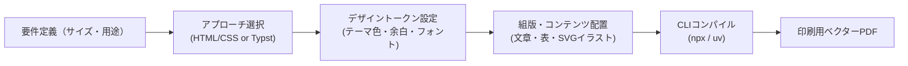

# Print Design & Programmable DTP Skill

このスキルは、チラシ・ポスター・帳票・表組みなど「後からテキストやフォントを編集でき、印刷に耐えうる高品質なPDFを出力したい」場合に、コードベース（HTML/CSS または Typst）でデザインを作成・ビルドするためのワークフローを提供します。

---

## ワークフロー概要



---

## ステップ1: 要件確認とアプローチ選択

1. **仕上がりサイズと用途の確認**:
   - 用紙サイズ: A4（210×297mm）、B5（182×257mm）、名刺（91×55mm）など
   - 向き: 縦（portrait） / 横（landscape）
   - 印刷種別: 商業印刷（トンボ・断ち落とし3mm要） / オフィス・家庭用プリンター / デジタル配布PDF

2. **ツールの選択**:
   - **HTML/CSS (Vivliostyle / WeasyPrint)**:
     - Webデザインのノウハウ（Flexbox, CSS Grid, Webフォント）を活かしたい場合
     - デザインの自由度が高く、テンプレート連携（Jinja2 / Mustache等）が容易
     - 推奨実行: `npx vivliostyle build` または `uv run weasyprint`
   - **Typst**:
     - ページ物のカタログ、厳密な表組み、数式、書籍風レイアウトを作成したい場合
     - プレーンテキストで簡潔に記述したい場合
     - 推奨実行: `npx @myriaddreamin/typst-ts-cli compile`

---

## ステップ2: テンプレートの配置とカスタマイズ

本スキル内に用意されているテンプレートをプロジェクトにコピーして利用します。

### パターンA: HTML/CSS (Paged Media)

テンプレートディレクトリ:
[templates/html-paged/](./templates/html-paged/)

1. **`theme.css`（デザイントークン）の編集**:
   - ブランドカラー、アクセントカラー、背景色、余白、フォントファミリーを一元管理。
   ```css
   :root {
     --color-primary: #1a73e8;
     --color-secondary: #ff6d00;
     --color-text: #202124;
     --color-bg-sub: #f8f9fa;
     
     --page-margin: 15mm;
     --base-radius: 4px;
     
     --font-base: "Noto Sans JP", -apple-system, sans-serif;
     --font-heading: "Noto Serif JP", serif;
   }
   ```
2. **`layout.css`（印刷ページ設定）**:
   - `@page` ルールで用紙サイズ、マージン、トンボ、断ち落とし（bleed）を設定。
   ```css
   @page {
     size: A4 portrait;
     margin: var(--page-margin);
     bleed: 3mm;
     marks: crop cross;
   }
   ```
3. **`index.html`（コンテンツ編集）**:
   - テキスト、`<table>` による表組み、`<svg>` によるベクターイラストを配置。

### パターンB: Typst

テンプレートファイル:
[templates/typst/flyer.typ](./templates/typst/flyer.typ)

1. 変数定義（色、マージン）を変更:
   ```typst
   #let primary-color = rgb("#1a73e8")
   #let page-margin = 15mm
   ```
2. ページ設定とテキスト・表組みを編集。

---

## ステップ3: CLIによるPDFビルド

プロジェクトルートまたは対象ディレクトリで以下のコマンドを実行します。

### 1. Vivliostyle（Node.js / npx）
出版・印刷向け組版ツール。トンボや見開き、裁ち落としに対応。
```bash
# ビルド実行（output.pdf を生成）
npx vivliostyle build index.html -o output.pdf

# プレビュー表示（ローカルサーバー起動）
npx vivliostyle preview index.html
```

### 2. WeasyPrint（Python / uv）
PythonベースのCSS Paged Mediaレンダラー。
```bash
# uvでインストール＆即時実行
uv run weasyprint index.html output.pdf
```

### 3. Typst（npx）
Typstソースファイルを即座にPDFへコンパイル。
```bash
npx @myriaddreamin/typst-ts-cli compile flyer.typ output.pdf
```

### 4. 付属のビルドスクリプト
本プラグインの [scripts/build.sh](./scripts/build.sh) を使用して統一的にビルドすることも可能です。
```bash
./scripts/build.sh html index.html output.pdf
# または
./scripts/build.sh typst flyer.typ output.pdf
```

---

## トラブルシューティング & ベストプラクティス

* **主客の明確化（関心事の最大化とメリハリ）**:
  - 来場者にとって最も関心が高い「フリーライブ」や「特典会」の内容を紙面の主役とし、全体の半分以上の面積と大きな文字でレイアウトします。物販や入場ルール、注意事項はコンパクトに整理・凝縮します。
* **用紙端まで行き渡る全面背景（白フチの解消）**:
  - 背景画像を用紙全面に敷き詰める場合、`@page { margin: 0; }` を指定し、最外層（`body` またはルート要素）に `background-size: cover;` を設定します。その上でコンテンツを包むコンテナに `padding: 8mm 10mm;` などの内側余白を設定することで、四辺に不自然な白枠を出さずに全面印刷が可能です。
* **大胆なジャンプ率（文字の大きさの階層化）**:
  - タイトル（22〜26pt）、特典会・ライブの目玉見出し（12〜16pt）、くじの賞名やチーム名（10〜11pt）、説明本文（8〜9pt）、注意事項（6.5〜7pt）といった明確な差をつけ、重要な情報がパッと目に飛び込むようにします。
* **重要情報（表組み等）のスペース保護**:
  - 特典会のくじ一覧やスケジュール表などの重要情報テーブルの横に装飾画像を配置すると表が圧迫されて読みづらくなります。表組みは横幅100%を確保し、装飾マスコット画像は見出し周辺やチーム枠などの自然な空きスペースに配置します。
* **時間経過（時系列順）の厳守と視覚的メリハリ**:
  - タイムラインは当日の行動フローに直結するため、必ず時間経過順（10:30物販 ➔ 12:25入場 ➔ 13:00ライブ ➔ 13:45特典会）を厳守します。関心事の強調は順序の入れ替えではなく、鮮やかなアクセントカラーや広いカード面積の割り当てによって行います。
* **大区画ブロック（特典会等）の余白最適化**:
  - 特典会のように情報量が多いセクションでは、メニュー、チーム分け、マスコットを均等グリッドで整列させ、下部に横幅100%のくじ内訳表を密着配置することで、無駄な余白（隙間）を一切出さず充実したレイアウトを実現します。
* **時刻バッジ（ピルバッジ）のサイズ・フォント統一**:
  - 各タイムテーブル項目の時刻バッジ（横幅、高さ、フォントサイズ、パディング）は紙面全体で一律（例: 横幅26mm固定、時刻11pt、ラベル7pt）に揃えます。文字数の違いによってバッジ幅が変わると整列感が失われるため、CSSで固定幅または `min-width` を指定して視線の縦軸を揃えます。
* **タイムテーブル項目間の隙間（デッドスペース）の解消とイラスト演出**:
  - 項目間の隙間が広くなりすぎると散漫な印象になるため、料金・出演者・見どころ説明などの記述に余裕を持たせ、目玉項目（ミニライブ等）にはステッカー風のワンポイントイラスト（マイク・音符等）や目立つバッジを配置して隙間を埋め、楽しい密度感を演出します。
* **フォントの選定と脱・画一化（コンセプトとWebフォントの連動）**:
  - イベントフライヤーを「とりあえず丸ゴシック」と一律に統一せず、グループのコンセプトや楽曲、イベントの性格に応じてフォントスタックを最適に選定します。
  - **公式Webフォント・世界観のリサーチ**: 対象アーティストの公式サイトのInspectやビジュアル資料を確認し、公式で採用されているフォント（例: `Shippori Mincho`, `Jost`, `Cormorant Garamond` 等）や楽曲イメージ（ロック、天使、透明感等）をデザインに取り入れます。
  - **代表的な組み合わせパターン**:
    - **Pop & Rock (モダン角ゴシック + ジオメトリック欧文)**: `Jost` / `Montserrat` + `M PLUS 1p` / `Noto Sans JP`。エッジと視認性の高さを両立。
    - **Angelic / Classical (優美な明朝体 + クラシカルセリフ欧文)**: `Cormorant Garamond` + `Shippori Mincho`（しっぽり明朝）。天使、透明感、上品さ、気品を表現。
    - **Live House / Festival (極太角ゴシック + コンデンスド欧文)**: `Oswald` / `Bebas Neue` + `Noto Sans JP 900`。タワーレコードやライブハウスのような熱気と圧倒的インパクト。
* **初回作成時における複数イメージ／配色のパターン提示**:
  - 初回提案時は、単一の案に絞らず、世界観の異なる数パターン（例: ロック＆パンク、エンジェリックホワイト、ライブハウス現場感など3パターン程度）を作成して提示します。
  - HTMLとCSS（`theme-*.css`）のトークン分離を徹底することで、コンテンツ構造を保ったまま配色・フォント・装飾の異なるバリエーションを迅速に生成・比較検証できます。
* **要素の周囲に半透明の四角い枠や、細長い背景の透過漏れ（シーム）が出る場合（極めて重要）**:
  - **原因**: Chromium/PuppeteerでPDFをレンダリングする際、CSSの `box-shadow` や `filter: drop-shadow`、`mix-blend-mode`（例: multiply）を使用していると、透過レイヤーの分割処理（タイリングやスタッキングコンテキスト）により、バウンディングボックスの半透明矩形アーティファクトや、要素の背後に下層背景画像がスリット状に細長く透けてしまうバグが発生します（画面上では見えずPDFでのみ現れる）。
  - **対策**: 印刷用PDFでは `box-shadow` や `mix-blend-mode` は完全撤廃し、カード背景にはプレーンなソリッドカラー（`#ffffff` 等）を指定してください。境界線（`border`）やコントラストで立体感や区切りを表現し、白背景イラストは白背景カードの上に直接置くことでブレンドモードなしで綺麗に同化させます。
* **参照元URLと印刷用ベクターQRコードの生成・配置**:
  - 印刷物からWebの一次情報や最新情報へ誘導する際は、`npx -y qrcode "<URL>" -t svg -o qr.svg` 等で**ベクター形式（SVG）**として生成します。ラスタ画像（低解像度PNG）のような拡大時のジャギーやボケを防ぎ、精密な印刷品質を担保できます。
  - スマートフォンでのカメラ読み取りを確実にするため、物理サイズは `15mm × 15mm` 以上を確保し、十分なクワイエットゾーン（白余白）を設けてください。
  - カメラで読み取れない状況や、PC等でPDFを閲覧するユーザーのために、QRコード周辺およびフッターにURLテキスト（リンク）も必ず併記します。
* **開催場所・前提情報の配置設計（ヘッダー統合）**:
  - 最重要の前提情報である「開催場所・会場アクセス」は、タイムテーブルの時刻列と混同しないよう、ヘッダーカード内に統合するか、ヘッダー直下に上方に配置します。施設名、フロア名、注意書き（待機不可・時間厳守）を整理して配置し、タイムラインとの主従関係を明確にします。
* **ヘッダー内Flexレイアウトのオーバーフロー防止**:
  - ヘッダーで左右分割配置を行う際、テキストに `white-space: nowrap` を多用すると内在幅が紙幅を超え、右側の要素（日付バッジ等）を用紙外へ押し出す原因となります。左側コンテナには `flex: 1 1 auto; min-width: 0;` を指定し、住所などの冗長な表記を簡潔化（例: 施設名＋フロアのみ）してフォントサイズを最適化し、紙面幅内に確実に収めます。
* **Google Fonts のウェイト最小化（Vivliostyle CLIクラッシュ防止）**:
  - 日本語Webフォント（特に `Shippori Mincho` など）を Vivliostyle 等のヘッドレスChromiumベースのレンダラーで読み込む際、ウェイトを多数（500, 700, 800等）指定すると分割.woff2ファイルの過剰フェッチにより内部タイムアウト（`Page.printToPDF: Printing failed`）が発生します。印刷用HTMLでは、必要なウェイトを最小限（例: `wght@700` のみ）に絞ってインポートします。
* **会場フロアマップの「入場案内枠」統合**:
  - ステージ、優先観覧エリア、女性専用エリア、入場導線等の会場図が提供されている場合は、開催場所よりも **【観覧エリア入場案内（整理番号順入場）】の枠内に配置** します。入場順、女性専用エリア、車椅子スペース、入場導線などの図面情報は、実際の入場集合案内の文脈と直接リンクして初めて現場で活きます。D2 CLIやベクターSVG（`floor_map.svg`）として自作・再構成することで、印刷時にも文字が一切潰れず、鮮明な品質を担保できます。
* **長文行間の確保とレギュレーションのタグ・ピルバッジ化**:
  - 特典会の参加条件やレギュレーション（人数、スマホ限定、1レーン開催、代行撮影可否など）は、単に太字にするだけでなく、**ピルバッジ（カラータグ）化・色分け** を行い、文章の行間（`line-height: 1.4〜1.55`）をゆったり広げます。文章が詰まると現場で瞬時に把握できなくなるため、余白と色分けによるスキャナビリティ（一覧性）を高めます。
* **「撮可TIME」と「撮影会」の厳格な分離原則**:
  - **撮可TIME（ライブ中）** と **撮影会（特典会）** は完全に別レギュレーションです。
    - **撮可TIME**: ミニライブ中の撮影許可（一般に一眼レフ・ミラーレス可、静止画のみ、動画・録音・フラッシュ・連写禁止）。
    - **撮影会（特典会）**: 特典会で行われる写真・動画撮影（一般にスマートフォン・タブレット限定、一眼レフ・コンデジ不可）。
  - これらを絶対に混同・混同表記せず、バッジおよび注意事項で明確に分離して表記します。
* **物販・参加レギュレーション（ループ制限・上限）の即応タグ配置**:
  - 平日開催などの特有ルールである「ループ不可（1会計のみ）」「解除アナウンス（公式X等）」「購入上限当日発表」はファンの行動導線における最重要項目です。タイムラインの物販枠内に目立つアラートバッジ（`alert-rule-tag`）として明記します。
* **特典会の進行順序とテーブルメニュー順の完全一致**:
  - 公式タイムテーブルに示された特典会の実施順（フリーお手振り ➔ ①動画お手振り ➔ ②グループshot ➔ ③2shot/ソロshot）と、メニュー表の行順序を100%揃えます。順番の齟齬をなくすことで、参加者がどのタイミングでどの券を使うべきかが直感的に伝わります。
* **対象商品の品番・盤種バッジ表示**:
  - 複数形態（集合盤、ユニット盤等）のエムカードやCDがある場合、品番（`BTRC-1055`等）と盤種名をセットにしたバッジをタイムライン内に一覧表示し、レジでの注文間違いを未然に防ぎます。
* **4Kディスプレイ・印刷品質でのプレビュー画像生成**:
  - 生成されたPDFを目視確認する際、文字潰れを防ぐため `qlmanage -t -s 3508 -o <dir> <pdf-file>` や Swift PDFKitレンダリングにより A4 300dpi相当（2480×3508px）以上の高精細PNGを出力し、4K環境でも細かな文字・注釈までクッキリ確認できるようにします。


